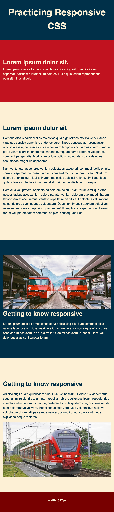

# Tutorial 08

**Course Title**: Web Development

**Course Code**: IRM1005 / ITEC1005

**Semester**: Fall 2023

**Due Date**: n/a

**Assessment**: n/a

## TLDR

1. Let's practice implementing responsive design using CSS and build a few practice example pages.
2. You will just be updating the `CSS` for this tutorial exercise.
3. Modify your files, and commit the changes back to your repo.
4. Turn on GitHub Pages.
5. Submit a comment in the [Tutorial 08 - Show and Tell discussion](https://github.com/orgs/irm1005-itec1005-fall-2023/discussions/13) and share a link to your index page.

## Table of contents

- [Final Solution Screenshots](#screenshots)
- [Description](#description)
- [Instructions](#instructions)
- [Additional Help](#additional-help)
- [Helpful Links](#📚-helpful-links)

## Screenshots

### Step 01

### Step 02

#### Mobile 

#### Desktop

### Step 03

#### Mobile 

#### Desktop

## Description

The goal of this tutorial is for students to gain some experience implementing responsive design using media queries.

## Instructions

You must have completed `Tutorial 07` before attempted this exercise. Completing this challenge will be very difficult without a solid understanding of the previous tutorials. The instructions below assume you have a working developer environment.

To complete this tutorial you must follow the steps below. Additional help can be found further below.

- There are three files that you are going to modify in this exercise, `style-01.css`, `style-02.css` and `style-03.css`.
- Using the final solution screenshots as a reference, you'll need to follow the instructions and add `CSS` code to style the various elements.
- If you get stuck, you can use the example in the `solutions` folder for guidance.
- Preview your pages using the LivePreview or LiveServer extentions in VSCode.
- Commit your changes and push to GitHub.
- Turn on [GitHub Pages](https://github.com/orgs/irm1005-itec1005-fall-2023/discussions/4) in the `settings` section of your repository.
- View your live web pages.
- In the [Tutorial 08 - Show and Tell discussion](https://github.com/orgs/irm1005-itec1005-fall-2023/discussions/13) in our GitHub Discussion Group, add a comment with a link to your pages.
- Check out some of your other team members work and make sure to tell them how awesome they are.

## Additional help

### Cloning your tutorial repository

Refer to the Birghtspace videos `Setting up all the things` for instructions on how to setup your local development environment and clone your tutorial repository so that you can work on your code locally.

### Activating GitHub pages

Refer to this [discussion post](https://github.com/orgs/irm1005-itec1005-fall-2023/discussions/4) for instructions on how to turn on the GitHub Pages service for your repository.

## 📚 Helpful links

### Flexbox

- [A guide to grid](https://css-tricks.com/snippets/css/complete-guide-grid/)
- [Learn CSS Grid](https://learncssgrid.com)
- [Grid Handbook](https://www.freecodecamp.org/news/complete-guide-to-css-grid/)
- [CSS Grid Tutorial](https://developer.mozilla.org/en-US/docs/Web/CSS/CSS_grid_layout)
- [Grid Cheetsheet](https://grid.malven.co)
- [Intro to CSS - Prof3ssorSt3v3](https://www.youtube.com/watch?v=KFKScNHa-8M&list=PLyuRouwmQCjl4wTSNbb8RTKZuyMhoIxBe)
- [CSS Tutorial - MDN](https://developer.mozilla.org/en-US/docs/Web/CSS)

### GitHub

- [A short video explaining what GitHub is](https://www.youtube.com/watch?v=w3jLJU7DT5E&feature=youtu.be)
- [Git and GitHub learning resources](https://docs.github.com/en/github/getting-started-with-github/git-and-github-learning-resources)
- [Understanding the GitHub flow](https://guides.github.com/introduction/flow/)
- [How to use GitHub branches](https://www.youtube.com/watch?v=H5GJfcp3p4Q&feature=youtu.be)
- [GitHub's Learning Lab](https://lab.github.com/)
- [Education community forum](https://education.github.community/)
- [GitHub community forum](https://github.community/)

### Git

- [Interactive Git training materials](https://githubtraining.github.io/training-manual/#/01_getting_ready_for_class)
